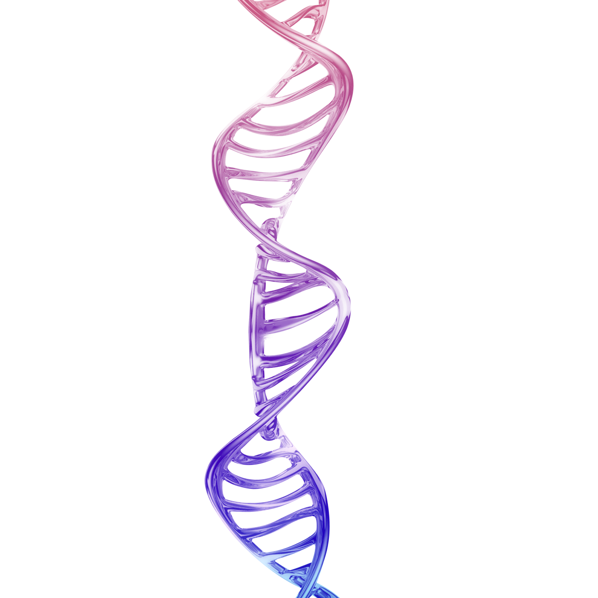

# J2P4_Transcriptomics

  

___

## Inleiding
Reuma inleiding, *+- 200 woorden met aanleiding, achtergrondinformatie en doelstel-
ling. Bronnen (PDF) kunnen in een aparte folder met verwijzing*

## Methode
*+- 200 woorden met methode, flowschema. Zie leerdoelen voor mi-
nimale inhoud. Scripts, data etc. kunnen in een aparte folder met verwijzing.*

## Resultaten
+- 200 woorden, inclusief correcte verwijzingen

## Conclusie
*+- 200 woorden, inclusief aanbevelingen en onderzoek in context
plaatsen*

Leerdoelen die je moet beheersen (deze mag weg bij het inleveren)

*(Schuin gaat over de inhoud
van je project* en *dikgedrukt over de competentie beheren):*
• *Je mapt reads met het Rsubread package in R
• Je bepaalt verschillen in genexpressie met het DESeq2 package in R
• Je bepaalt verschillen in KEGG pathways in R
• Je bepaalt verschillen in gene ontologies in R*
• **Je legt uit hoe je onderzoeksgegevens en scripts kan beheren
• Je voert een project uit waarbij je als data steward de projectgegevens beheert
• Je legt uit hoe je als data steward projectgegevens hebt beheerd**
